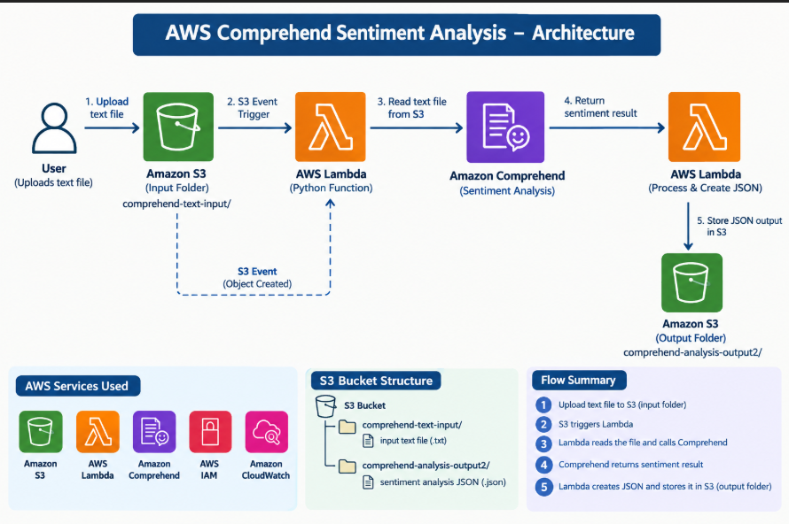
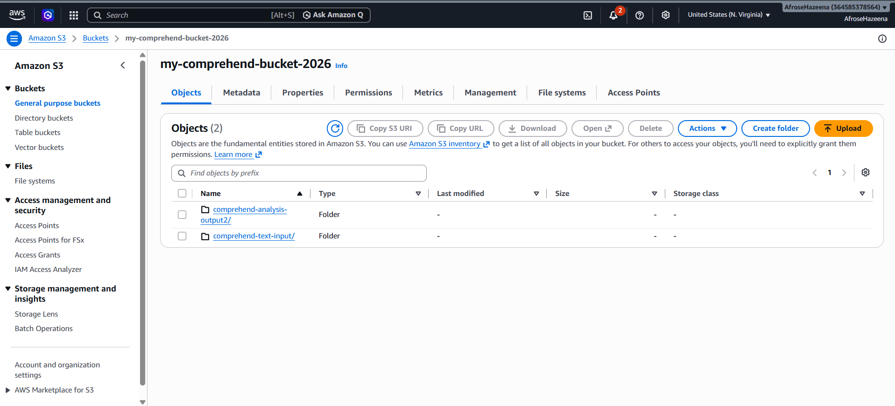
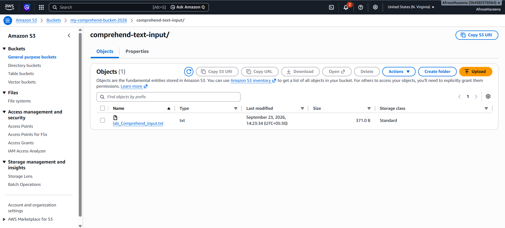
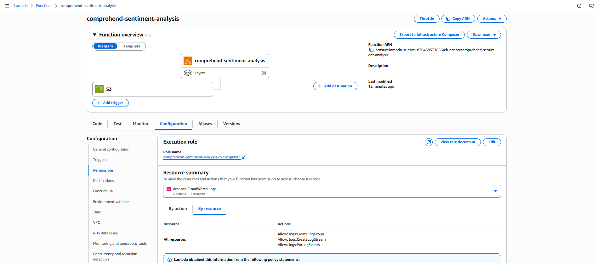
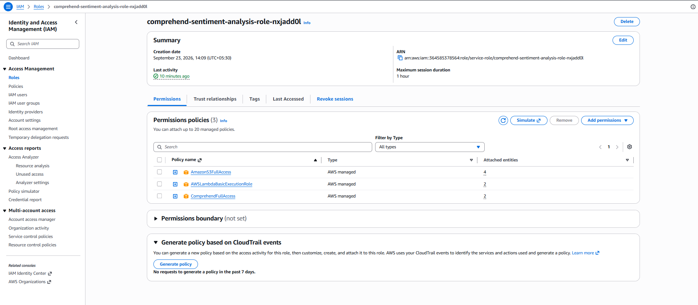
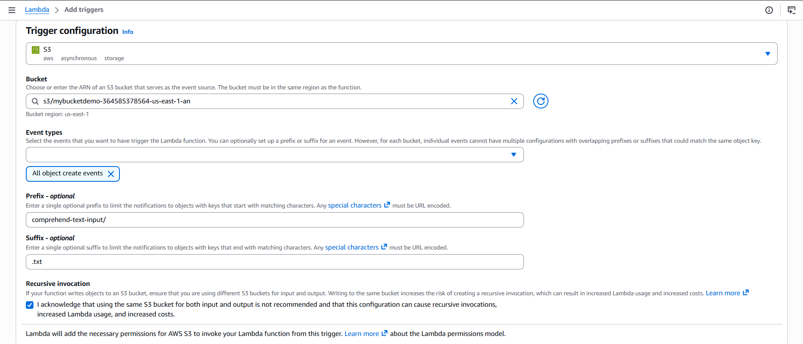
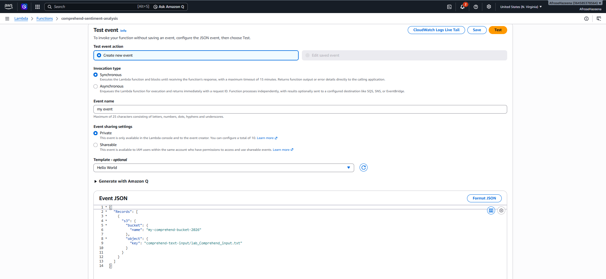
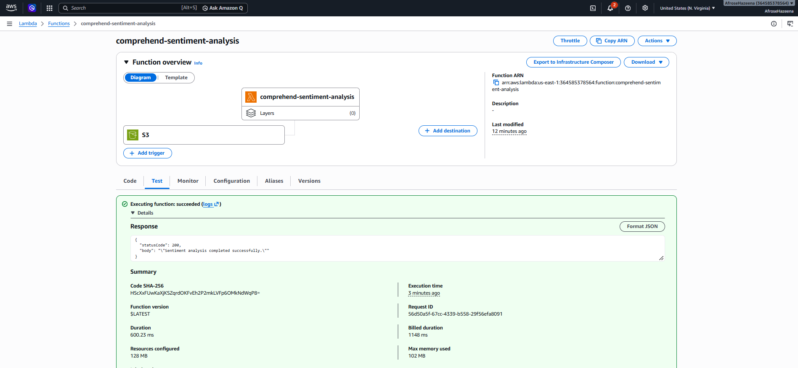
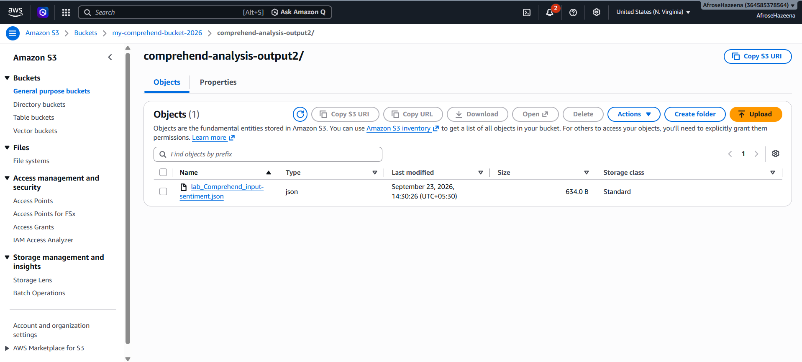
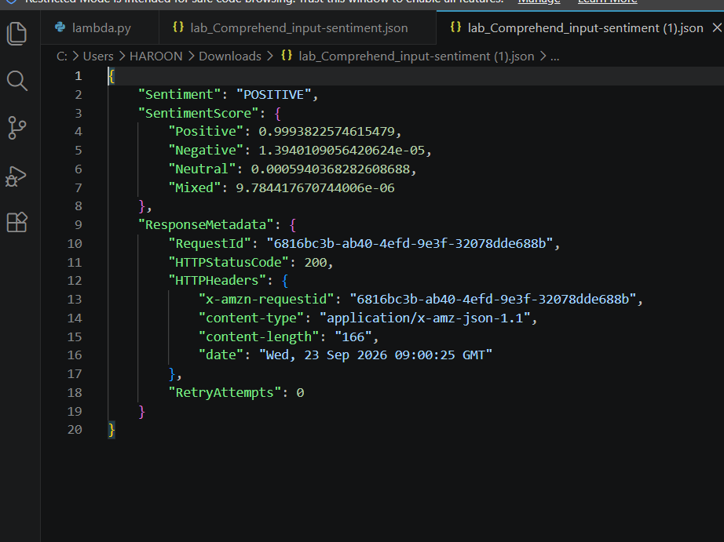

# AWS Lab – Amazon Comprehend Sentiment Analysis

## Overview

Amazon Comprehend is a natural language processing (NLP) service that uses machine learning to analyze text and identify insights such as sentiment.

In this lab, we upload a text file to Amazon S3, trigger an AWS Lambda function, analyze the text using Amazon Comprehend, and store the sentiment analysis result as a JSON file in Amazon S3.

---

## Architecture

### Components

- Amazon S3
- AWS Lambda
- Amazon Comprehend
- AWS IAM
- Amazon CloudWatch

---

## Step 1: Create S3 Input and Output Folders

An Amazon S3 bucket was used to store the input text file and the sentiment analysis output.

Two folders were created:

- `comprehend-text-input/`
- `comprehend-analysis-output2/`

---

## Step 2: Upload Input Text File

A text file containing sample text was uploaded to the `comprehend-text-input/` folder.

The text file is used as the input for Amazon Comprehend sentiment analysis.

---

## Step 3: Create Lambda Function

An AWS Lambda function was created using Python.

The Lambda function reads the text file from S3, sends the text to Amazon Comprehend for sentiment analysis, and stores the analysis result as a JSON file in the S3 output folder.

---

## Step 4: Configure Lambda IAM Role

An IAM execution role was attached to the Lambda function.

The role provides the required permissions to access Amazon S3, Amazon Comprehend, and CloudWatch Logs.

### Permissions

- Amazon S3 GetObject
- Amazon S3 PutObject
- Amazon Comprehend DetectSentiment
- CloudWatch Logs

---

## Step 5: Add S3 Trigger to Lambda

An Amazon S3 trigger was added to the Lambda function.

Configure:

- Event Type: **All object create events**
- Prefix: `comprehend-text-input/`
- Suffix: `.txt`

The trigger automatically invokes the Lambda function whenever a `.txt` file is uploaded to the input folder.

---

## Step 6: Configure Lambda Test Event

A test event was created using an S3 event structure containing the S3 bucket name and input file key.

---

## Step 7: Test Lambda Function

The Lambda function was tested using the configured S3 event.

The function:

- Receives the S3 event.
- Identifies the S3 bucket and object.
- Reads the text file from S3.
- Sends the text to Amazon Comprehend.
- Performs sentiment analysis.
- Creates the JSON result.
- Stores the result in S3.

---

## Step 8: Verify S3 Trigger

After uploading a `.txt` file to the S3 input folder, the S3 event automatically triggered the Lambda function.

The Lambda function processed the file and generated the sentiment analysis output.

---

## Step 9: View Sentiment Analysis Output

The sentiment analysis result was stored as a JSON file in the `comprehend-analysis-output2/` folder.

The output contains the detected sentiment and confidence scores returned by Amazon Comprehend.

---

## Conclusion

In this lab, we:

- Created S3 input and output folders.
- Uploaded a text file to Amazon S3.
- Created an AWS Lambda function using Python.
- Configured an IAM execution role and permissions.
- Added an S3 trigger to Lambda.
- Configured and tested an S3 event.
- Used Amazon Comprehend for sentiment analysis.
- Generated a sentiment analysis JSON output.
- Stored the output back in Amazon S3.

This lab demonstrates an event-driven AWS AI workflow using Amazon S3, AWS Lambda, and Amazon Comprehend to automatically perform sentiment analysis on uploaded text files.
