# AWS Lab – Amazon Polly Text-to-Speech

## Overview

Amazon Polly is a text-to-speech service that uses deep learning to convert text into lifelike speech.

In this lab, we send text to an Amazon API Gateway endpoint, which triggers an AWS Lambda function. The Lambda function converts the text into speech using Amazon Polly, stores the generated MP3 file in Amazon S3, and returns a pre-signed URL to download the audio.

---

## Architecture

### Components

- Amazon API Gateway
- AWS Lambda
- Amazon Polly
- Amazon S3
- AWS IAM
- PowerShell-AWSCLI (API client)

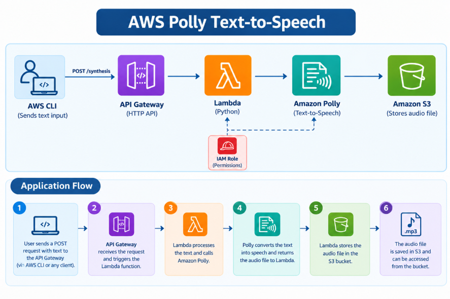

---

## Step 1: Create S3 Bucket

An Amazon S3 bucket named `polly-audio-storage-lab` was created to store the audio files generated by Amazon Polly.

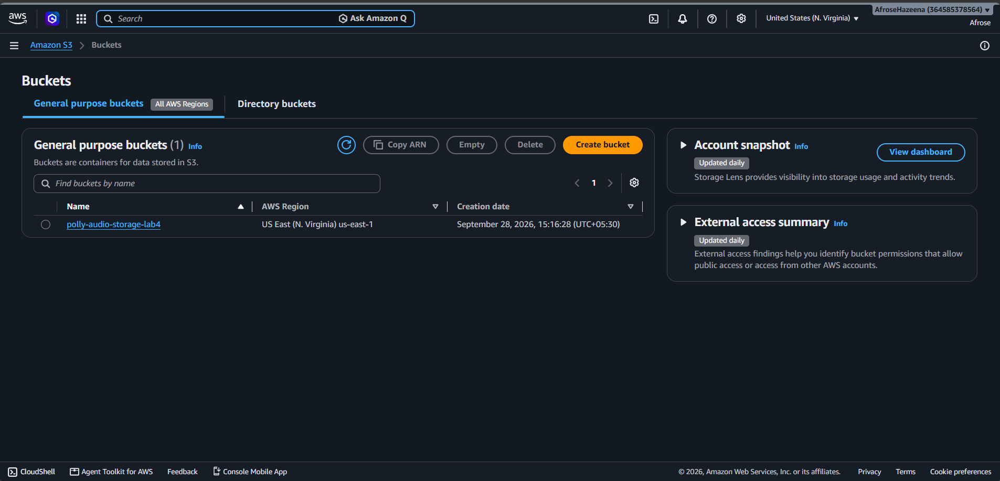

---

## Step 2: Create IAM Role for Lambda

An IAM execution role was created and attached to the Lambda function.

The role provides the required permissions to access Amazon Polly, Amazon S3, and CloudWatch Logs.

### Permissions

- AmazonPollyFullAccess
- AmazonS3FullAccess
- AWSLambdaBasicExecutionRole

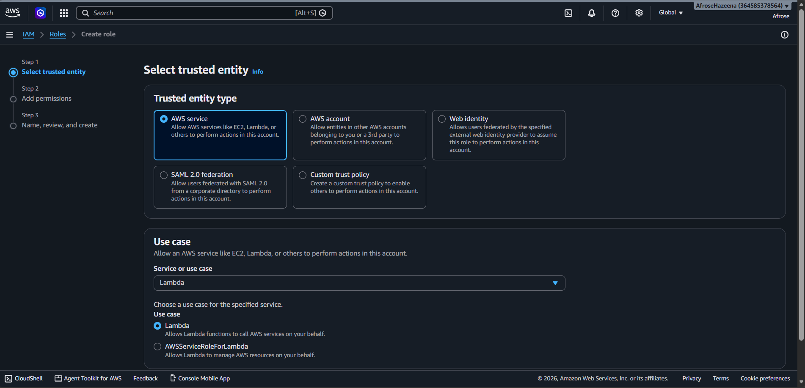

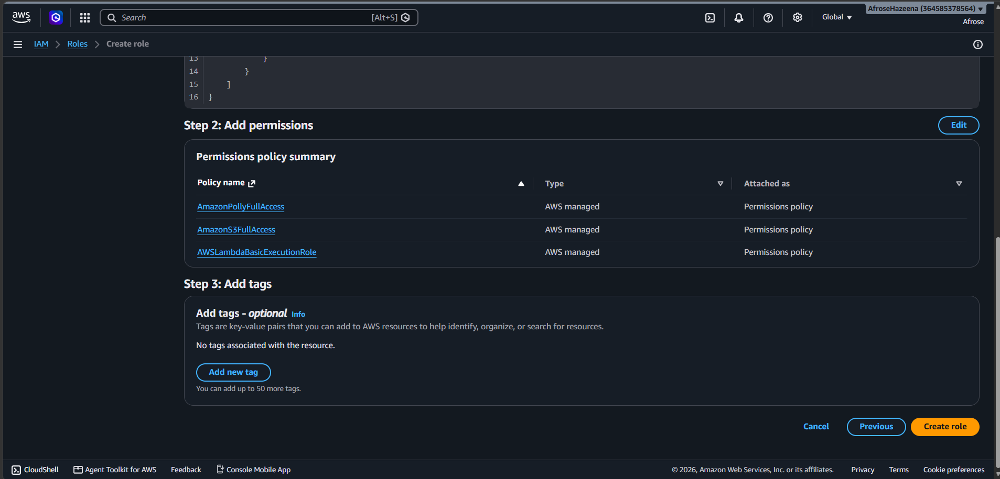

---

## Step 3: Create Lambda Function

An AWS Lambda function was created using Python (boto3).

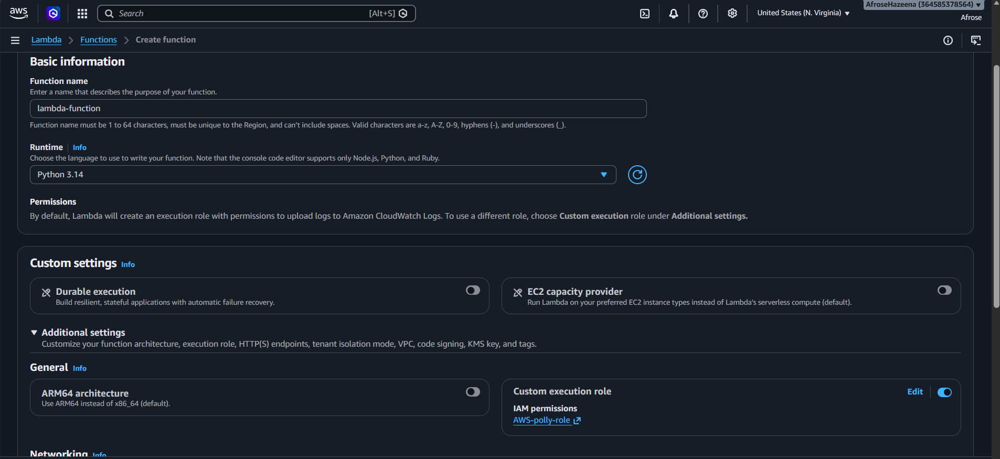

The Lambda function:

- Receives the `text` and `voice` values from the API request body (defaults to `Joanna` if no voice is given).
- Sends the text to Amazon Polly using the **neural** engine and requests MP3 output.
- Saves the generated audio temporarily in the Lambda `/tmp` directory with a unique file name (`audio-<uuid>.mp3`).
- Uploads the MP3 file to the S3 bucket.
- Generates a pre-signed URL (valid for 1 hour) and returns it as `audio_url` in the API response.

```python
import json
import boto3
import uuid

polly = boto3.client('polly')
s3 = boto3.client('s3')

BUCKET_NAME = 'polly-audio-storage-lab'

def lambda_handler(event, context):
    try:
        body = json.loads(event.get('body', '{}')) if isinstance(event.get('body'), str) else event.get('body', {})
        text = body.get('text', 'Hello from Amazon Polly.')
        voice_id = body.get('voice', 'Joanna')

        polly_response = polly.synthesize_speech(
            Text=text,
            OutputFormat='mp3',
            VoiceId=voice_id,
            Engine='neural'
        )

        file_id = str(uuid.uuid4())
        file_name = f"audio-{file_id}.mp3"
        file_path = f"/tmp/{file_name}"

        if "AudioStream" in polly_response:
            with open(file_path, "wb") as f:
                f.write(polly_response["AudioStream"].read())

        s3.upload_file(
            file_path,
            BUCKET_NAME,
            file_name,
            ExtraArgs={'ContentType': 'audio/mpeg'}
        )

        presigned_url = s3.generate_presigned_url(
            'get_object',
            Params={'Bucket': BUCKET_NAME, 'Key': file_name},
            ExpiresIn=3600
        )

        return {
            'statusCode': 200,
            'headers': {
                'Content-Type': 'application/json',
                'Access-Control-Allow-Origin': '*'
            },
            'body': json.dumps({
                'message': 'Speech synthesized successfully!',
                'audio_url': presigned_url,
                'file_name': file_name
            })
        }

    except Exception as e:
        return {
            'statusCode': 500,
            'body': json.dumps({'error': str(e)})
        }
```
---

## Step 4: Create API Gateway

An Amazon API Gateway (HTTP API) was created to expose the Lambda function as an HTTP endpoint.

The API exposes a `POST /synthesize` route that receives the text and voice from the client and forwards them to the Lambda function.

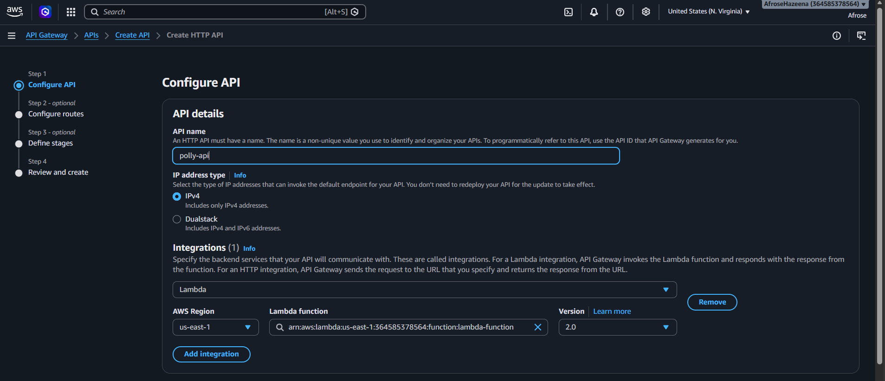

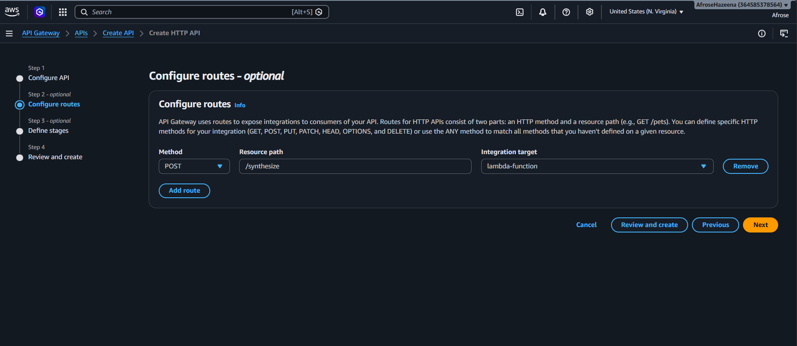

---

## Step 5: Add API Gateway Trigger to Lambda

The API Gateway was added as a trigger to the Lambda function.

This allows the Lambda function to be invoked automatically whenever a request is sent to the API endpoint.

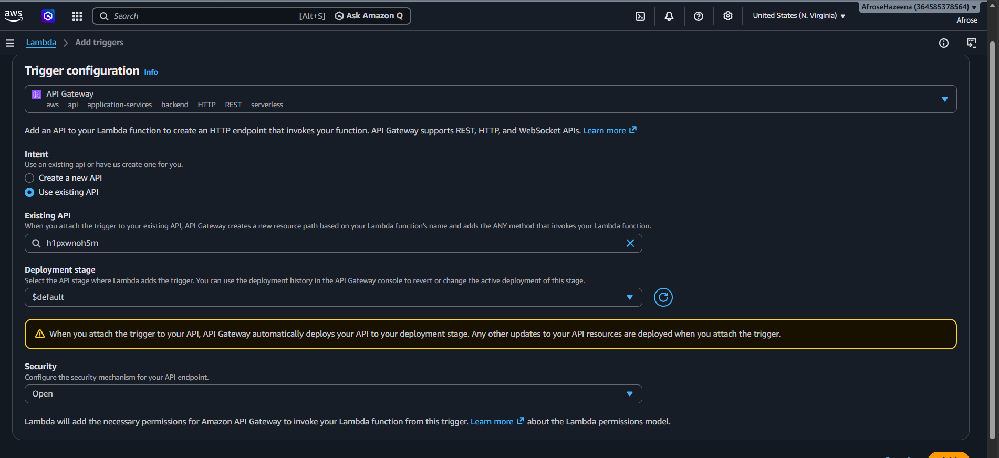

---

## Step 6: Copy the API Invoke URL

After the trigger was configured, the API invoke URL was copied from the Lambda trigger configuration.

This URL, along with the `/synthesize` route, is used as the endpoint in the PowerShell function.

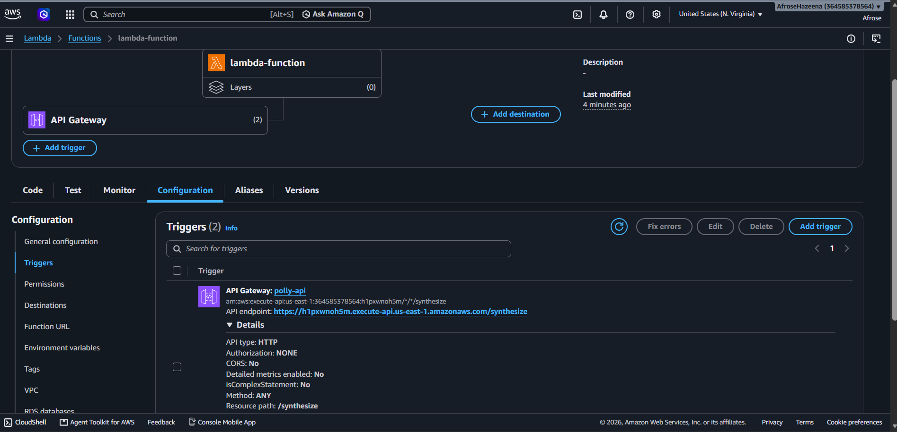

---

## Step 7: Invoke the API using PowerShell

A PowerShell function `Speak-Text` was created to call the API Gateway endpoint.

The function:

- Sends a POST request to the `/synthesize` endpoint with the text and voice (default: `Matthew`) in JSON format.
- Receives the `audio_url` returned by the Lambda function.
- Downloads the generated MP3 file and plays it automatically.

```powershell
function Speak-Text {
    param(
        [Parameter(Mandatory=$true)]
        [string]$Text,
        [string]$Voice = "Matthew",
        [string]$OutFile = "speech.mp3"
    )

    $body = @{ text = $Text; voice = $Voice } | ConvertTo-Json
    $url = "https://<api-id>.execute-api.us-east-1.amazonaws.com/synthesize"

    Write-Host "Synthesizing with Amazon Polly..." -ForegroundColor Cyan
    $res = Invoke-RestMethod -Uri $url -Method Post -ContentType "application/json" -Body $body

    Invoke-WebRequest -Uri $res.audio_url -OutFile $OutFile
    Invoke-Item $OutFile
}
```

Example usage:

```powershell
Speak-Text "Hello, this is Amazon Polly" 
```

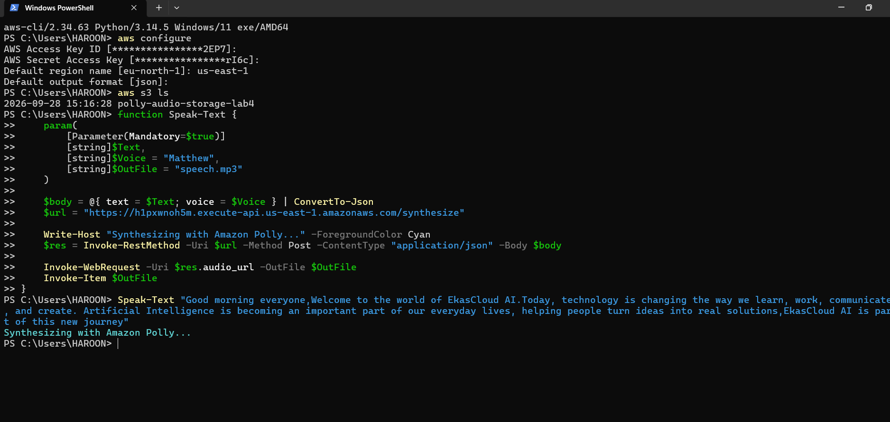

---

## Step 8: Output Audio

The downloaded audio file was played to confirm that Amazon Polly successfully converted the input text into speech.

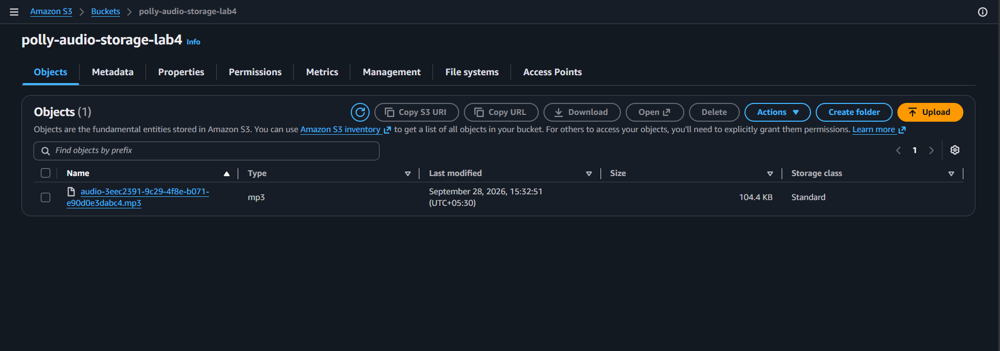

---

## Step 9: Verify and Download Audio from S3

The generated MP3 file (`audio-<uuid>.mp3`) was verified in the S3 bucket and downloaded manually to confirm it matches the audio returned by the API.

The `audio_url` returned by the Lambda is a pre-signed S3 URL that expires after 1 hour.

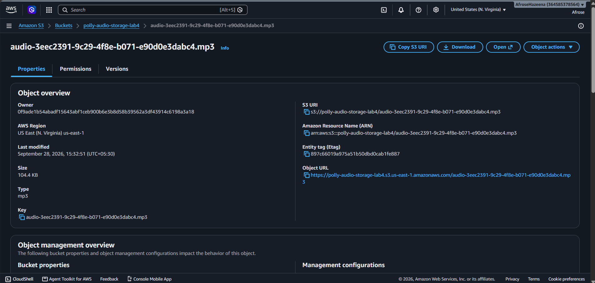

---

## Step 10: Audio Saved Locally

The function downloaded the generated MP3 file from the returned `audio_url` and saved it locally as `speech.mp3`.

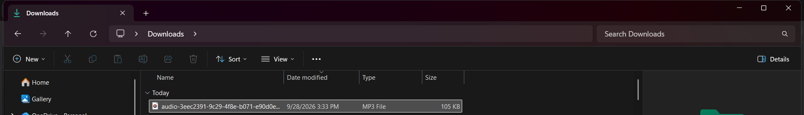

---

## Notes

- The Lambda uses the Polly **neural** engine, so the `voice` value must be a neural-supported voice (for example `Joanna`, `Matthew`, `Ruth`). Voices that only support the standard engine will cause the request to fail with a 500 error.
- The pre-signed URL expires after 1 hour. Call the API again to generate a new one.
- Each request creates a new MP3 file in the S3 bucket. Delete old files or add a lifecycle rule to avoid unnecessary storage costs.
- Delete the API Gateway, Lambda function, and S3 bucket after the lab to avoid unexpected charges.

---

## Conclusion

In this lab, we:

- Created an Amazon S3 bucket to store audio files.
- Created an IAM execution role with the required permissions.
- Created an AWS Lambda function using Python.
- Created an API Gateway and added it as a trigger to Lambda.
- Invoked the API using a PowerShell function.
- Used Amazon Polly to convert text into speech.
- Stored the generated audio file in Amazon S3 and returned a pre-signed URL.
- Downloaded and played the output audio.

This lab demonstrates a serverless text-to-speech workflow using Amazon API Gateway, AWS Lambda, Amazon Polly, and Amazon S3.
